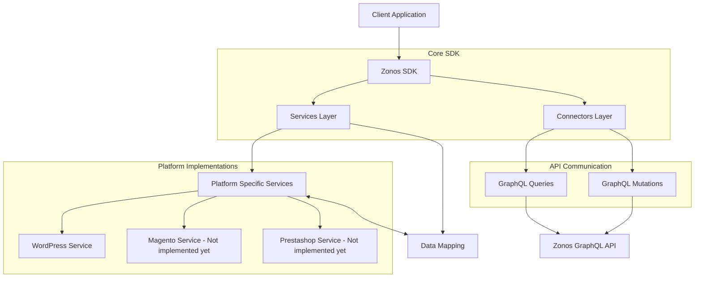
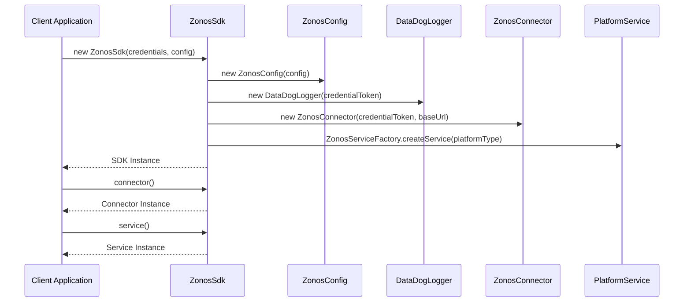
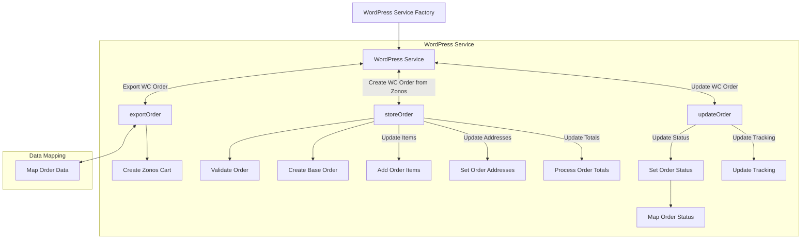
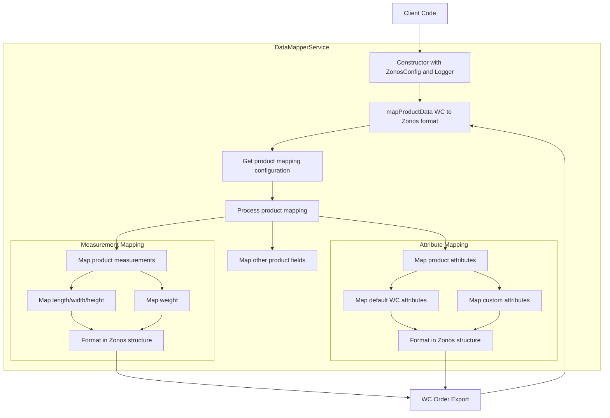

# Zonos PHP SDK

This project is a PHP SDK for integrating with Zonos services, providing seamless access to the Zonos GraphQL API and
generic utilities for integration with common e-commerce platforms.

The SDK is a PHP library that provides a clean and simple interface to interact with Zonos' services. It handles
authentication, API requests, and data mapping for various Zonos platform features including parts of the checkout
authentication schemas.

## Requirements

- PHP 8.0 or higher
- Composer

## Installation

Install the package via Composer:

```bash
# TBD Not working yet
composer require zonos/zonos-sdk
```

## Basic Usage

```php
use Zonos\ZonosSdk\ZonosSdk;
use Zonos\ZonosSdk\Enums\ZonosPlatformType;

// Initialize the SDK
$sdk = new ZonosSdk(
    credentialToken: 'your_credential_token',
    baseUrl:         'https://api.zonos.com',
    config:           [],
    platformType:    ZonosPlatformType::Default
);

// Get the utility service instance
$service = $sdk->service();

// Get the checkout service instance
$connector = $sdk->connector();

// Get the authentication service instance
$authConnector = $sdk->authConnector();
```

## Architecture Overview

The Zonos SDK is structured with several key components:

### Main Components Flow



### SDK Initialization Flow



## Features

- Authentication Schema Request Handling
- Checkout Schema Request Handling
- Data mapping services
- PHP Platform Factories Integration

## Configuration

The SDK can be configured with various options through the config array passed to the constructor.

### Data Mapping Configuration

To configure the data mapping service, you can pass a configuration array to the constructor. The configuration array
should contain the following options:

- `mappings`: An array of data mapping configurations. Each configuration should contain the following options:
  - `product`: An array of equivalent fields between the Zonos schema and the e-commerce platform schema.

#### Example:

```php
$sdk = new ZonosSdk(
    credentialToken: 'your_credential_token',
    baseUrl:         'https://api.zonos.com',
    config:           [
                        'mappings' => [
                            'product' => [
                              'name' => 'title',
                              'productId' => 'id',
                              'amount' => 'price',
                              //   ...
                            ],
                        ],
                      ],
    platformType:    ZonosPlatformType::Default
);
```

## Platform-Specific Integrations

### WordPress/WooCommerce Integration

The SDK provides a dedicated WordPress service to integrate with WooCommerce:



## Data Mapping Process

The SDK includes a robust data mapping service that transforms data between e-commerce platforms and Zonos formats:



### Connectors

The SDK provides two connectors:

- Connector: Handles the checkout schema requests.
- AuthConnector: Handles the authentication schema requests.

The way that they are structured is to allow an easy and lightweight interface with GraphQL.

The connectors carry method representative of the queries and mutations available in the GraphQL schema. And eache method carries a `get` method that allows to specify the fields to be returned in the response.

So where are a few examples of how to use the connectors:

#### Querying an order by its ID

```graphql
query Order($orderId: ID!) {
  order(orderId: $orderId) {
    root {
      exchangeRates {
        rate
        targetCurrencyCode
        sourceCurrencyCode
      }
    }
    amountSubtotals {
      discounts
      duties
      fees
      items
      shipping
      taxes
    }
    currencyCode
    id
    items {
      amount
      currencyCode
      productId
      quantity
      sku
      attributes {
        key
        value
      }
    }
    parties {
      type
      location {
        administrativeArea
        countryCode
        line1
        line2
        locality
        postalCode
      }
      person {
        companyName
        email
        firstName
        lastName
        phone
      }
    }
    shipmentRatings {
      serviceLevelCode
      displayName
    }
    status
  }
}
```

```php
$sdk->connector()->order(['orderId' => $order_id])->get(
      'root.exchangeRates.rate',
      'root.exchangeRates.targetCurrencyCode',
      'root.exchangeRates.sourceCurrencyCode',
      'amountSubtotals.discounts',
      'amountSubtotals.duties',
      'amountSubtotals.fees',
      'amountSubtotals.items',
      'amountSubtotals.shipping',
      'amountSubtotals.taxes',
      'currencyCode',
      'id',
      'items.amount',
      'items.currencyCode',
      'items.productId',
      'items.quantity',
      'items.sku',
      'items.attributes.key',
      'items.attributes.value',
      'parties.type',
      'parties.location.administrativeArea',
      'parties.location.countryCode',
      'parties.location.line1',
      'parties.location.line2',
      'parties.location.locality',
      'parties.location.postalCode',
      'parties.person.companyName',
      'parties.person.email',
      'parties.person.firstName',
      'parties.person.lastName',
      'parties.person.phone',
      'shipmentRatings.serviceLevelCode',
      'shipmentRatings.displayName',
      'status',
    );
```

#### Mutating an order

```graphql
mutation orderUpdateAccountOrderNumber(
  $account_order_number: String!
  $order_id: ID!
) {
  orderUpdateAccountOrderNumber(
    input: { accountOrderNumber: $account_order_number, id: $order_id }
  ) {
    id
    accountOrderNumber
  }
}
```

```php
$input = OrderUpdateAccountOrderNumberInput::fromArray([
    'accountOrderNumber' => $account_order_number,
    'id' => $order_id,
]);

$response = $sdk->connector()->orderUpdateAccountOrderNumber($input)->get('id', 'accountOrderNumber');
```

## Services

The SDK provides several services:

- WordPressService: Handles WooCommerce order data integration with Zonos
- DataMapperService: Maps data between platform formats and Zonos formats
- Authentication Service: Manages API authentication
- Checkout Service: Handles checkout processes
